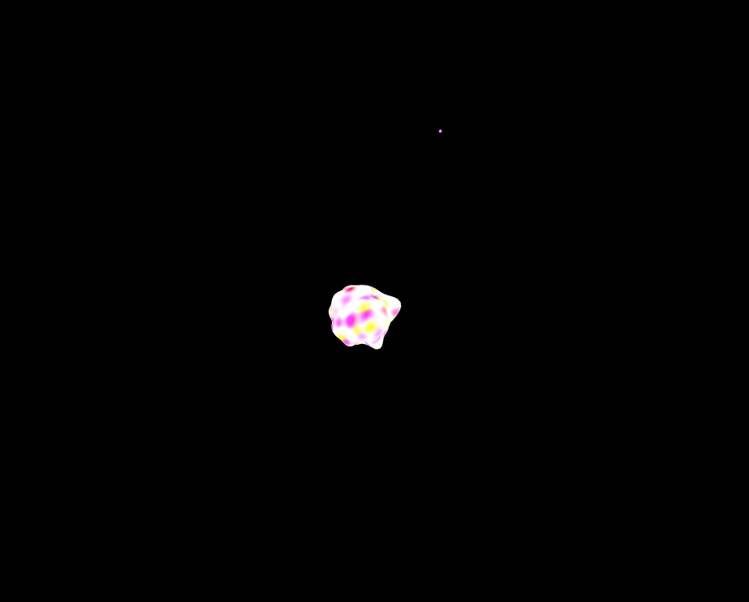

## Hydrogen Atom Animation Using Three.js
### A simple 3d animation of an electron orbiting a proton. 
```bash
npm i
npm run dev
```


#### All credit for the code implementing the shaders goes to Mark Horgan and his repo [here](https://github.com/markhorgan/three-js-shaders)
